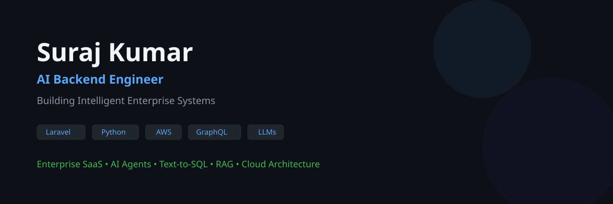

<div align="center">



<br/>

<a href="https://github.com/surajj2024"></a>
<a href="https://github.com/surajj2024?tab=stars"></a>

<a href="https://www.linkedin.com/in/suraj-kumar-5b34a61b3/"></a>
<a href="https://medium.com/@surajjkumar9608"></a>

<br/><br/>


</div>

<br/>


## 🧑‍💻 About Me


I'm **Suraj Kumar**, an **AI Backend Engineer** at **Thinqpixel** 🇮🇳, passionate about building scalable enterprise systems and intelligent AI-powered applications.

```yaml
name:       Suraj Kumar
role:       AI Backend Engineer
company:    Thinqpixel
location:   India 🇮🇳
focus:      Enterprise AI · Backend Systems · Cloud Architecture
writing:    medium.com/@surajjkumar9608
```

**What drives me:**
- 🤖 Designing **AI Agents** and **LLM-powered** enterprise workflows
- ⚡ Building high-performance **GraphQL** & **REST** APIs with Laravel
- ☁️ Architecting scalable systems on **AWS** (Bedrock, Lambda, S3)
- 🐍 Exploring **Python**, **MLOps**, and **Agentic AI**
- 🏗️ Obsessed with **clean architecture** and **system design**

<br/>


## 🛠️ Tech Stack

<div align="center">

### 💬 Languages


### ⚙️ Backend & APIs


### 🗄️ Databases & Storage


### ☁️ Cloud, DevOps & Tools


</div>

<br/>


## 🎯 What I Build

<div align="center">

| 🧠 AI Engineering | ⚙️ Backend Engineering | ☁️ Cloud & DevOps | 🏗️ System Design |
|:---:|:---:|:---:|:---:|
| LLMs & RAG | Laravel & GraphQL | AWS (Bedrock, Lambda) | Multi-Tenant SaaS |
| AI Agents | REST APIs | Docker & CI/CD | Distributed Systems |
| Prompt Engineering | Python & FastAPI | PostgreSQL & Redis | Microservices |
| Text-to-SQL | Node.js | S3 & API Gateway | Event-Driven Arch |
| Embeddings | Queue Systems | Linux & Networking | Clean Architecture |

</div>

<br/>


## 🌟 Featured Projects

<div align="center">

### 🚀 Enterprise SaaS Platform — VisionSync

</div>

> Multi-tenant strategic planning platform with AI-assisted workflows, dynamic metadata engine, and real-time collaboration.

<div align="center">


</div>

```
✦ GraphQL APIs with dynamic schema resolution
✦ Multi-tenant architecture with row-level security
✦ AI-assisted data import via LLM validation pipeline
✦ Redis-backed queue system for async processing
✦ Deployed on AWS with Docker containerization
```

---

<div align="center">

### 🤖 AI Text-to-SQL Assistant

</div>

> Convert natural language queries into optimized, secure SQL using LLMs with schema-aware context retrieval.

<div align="center">


</div>

```
✦ Schema-aware prompting with vector similarity search
✦ Multi-tenant security — users only query their own data
✦ SQL validation & sanitization layer
✦ Conversational interface with context memory
✦ Powered by AWS Bedrock + Claude
```

---

<div align="center">

### 📊 Enterprise AI Data Ingestion Pipeline

</div>

> LLM-powered Excel ingestion pipeline that understands messy, unstructured data and maps it to structured schemas.

<div align="center">


</div>

```
Excel → Parser → Embedding → Similarity Search → LLM Validation → Database
```

---

<div align="center">

### 🧠 AI Pull Request Reviewer

</div>

> Automated AI code reviewer that analyzes pull requests, suggests improvements, and enforces best practices — all via LLMs.

<div align="center">


</div>

```
✦ Integrates with GitHub Actions CI/CD pipeline
✦ Reviews code quality, security, and performance
✦ Generates AI-powered commit messages with Gemini
✦ Configurable rules and severity levels
```

<br/>


## 📝 Latest Articles on Medium

<div align="center">

| 📖 Article | 🔗 Link |
|:-----------|:--------|
| 🤖 I Built an AI That Reviews My Pull Requests | [Read →](https://medium.com/@surajjkumar9608/i-built-an-ai-that-reviews-my-pull-requests-d9a591255e75) |
| 🔄 AI Pull Request Reviewer — Updated | [Read →](https://medium.com/@surajjkumar9608/i-built-an-ai-that-reviews-my-pull-requests-fd44360d54bd) |
| ✍️ AI-Powered Git Commit Messages with Gemini | [Read →](https://medium.com/@surajjkumar9608/ai-powered-git-commit-messages-using-gemini-8aa6a5498287) |

</div>

<br/>


## 📊 GitHub Analytics

<div align="center">


</div>

<div align="center">


</div>

<div align="center">


</div>

<br/>


## 🏆 GitHub Trophies

<div align="center">


</div>

<br/>


## 🐍 Contribution Snake

<div align="center">

<picture>
  <source media="(prefers-color-scheme: dark)" srcset="https://raw.githubusercontent.com/surajj2024/surajj2024/output/github-contribution-grid-snake-dark.svg"/>
  <source media="(prefers-color-scheme: light)" srcset="https://raw.githubusercontent.com/surajj2024/surajj2024/output/github-contribution-grid-snake.svg"/>
  
</picture>

</div>

<br/>


## 📚 Currently Learning

<div align="center">

| 🔄 In Progress | 📌 Next Up |
|:---:|:---:|
| AI Agents & Agentic Workflows | LangGraph |
| AWS Bedrock | Kubernetes |
| Python Advanced Patterns | MLOps |
| Distributed Systems | Vector Databases |

</div>

<br/>


## 💡 Engineering Philosophy

<div align="center">

> *"Great software isn't measured by the number of lines of code,*
> *but by the number of problems it quietly solves."*

</div>

<br/>


## 🤝 Let's Connect

<div align="center">

<a href="https://www.linkedin.com/in/suraj-kumar-5b34a61b3/">
  
</a>
&nbsp;
<a href="https://medium.com/@surajjkumar9608">
  
</a>
&nbsp;
<a href="mailto:surajjkumar9608@gmail.com">
  
</a>
&nbsp;
<a href="https://github.com/surajj2024">
  
</a>

</div>

<br/>


<div align="center">


<br/>

**Suraj Kumar** · AI Backend Engineer · India 🇮🇳

*Building scalable software, intelligent systems, and meaningful developer experiences.*

<br/>

⭐ **If you find my work useful, consider giving a star!** ⭐

</div>
